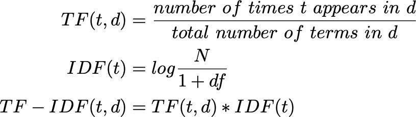
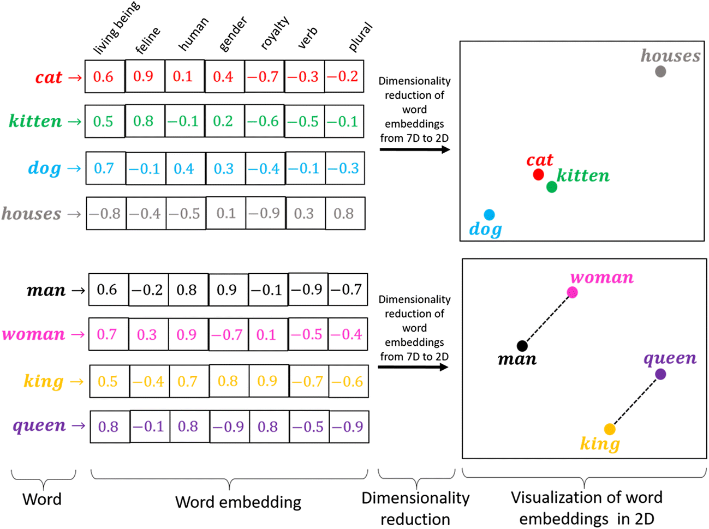
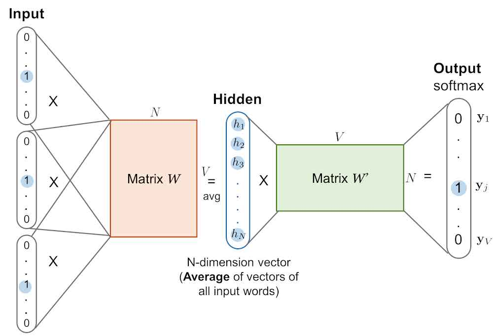
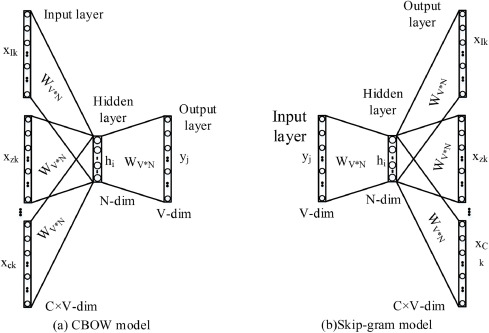
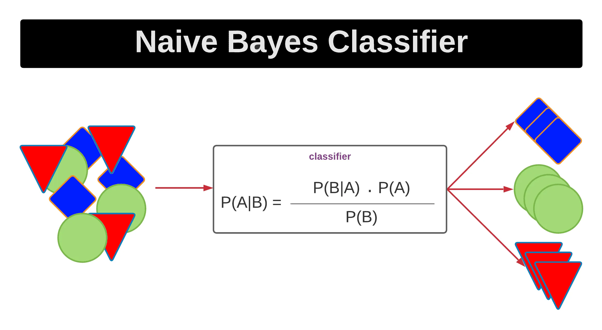
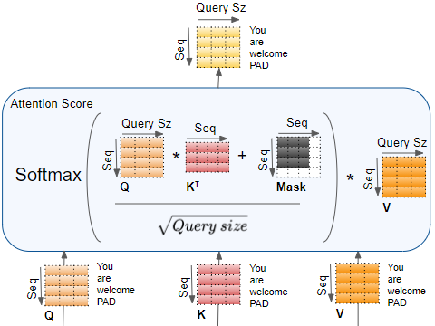
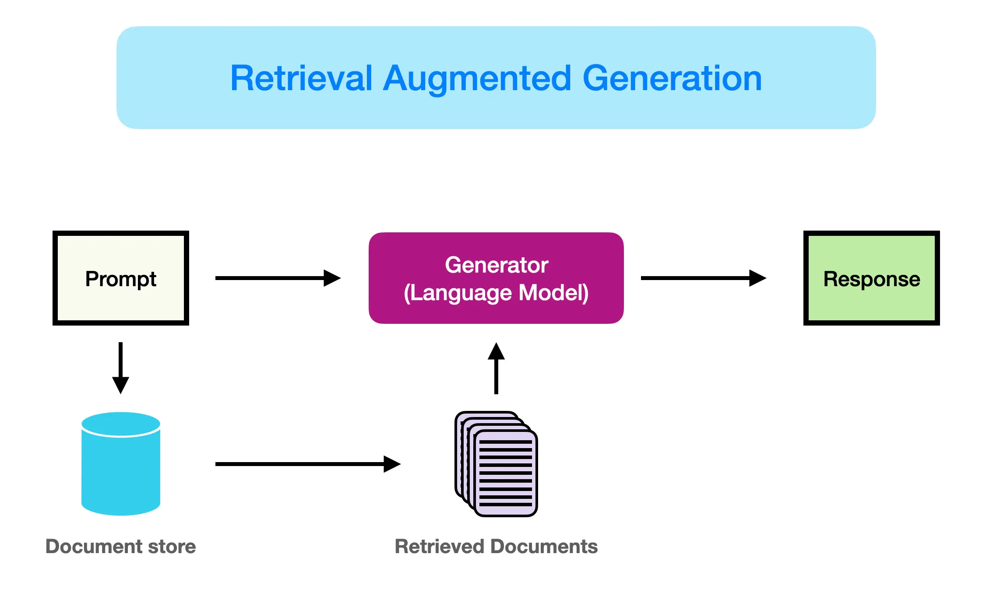

# NLP Journy 


* 1960s: Bernard Widrow and Marcian Hoff developed models called ADALINE.
* The modern deep learning era started in 2006.
* Before that, we worked with statistics, machine learning algorithms, and non-trainable algorithms.

### Why NLP and Deep Learning?

Why did we generate a whole branch of deep learning called NLP, which then upgraded to today's trends like LLMs or Vision-LLMs (same base structure)? Why didn't we use simple NN and simple encoding techniques like one-hot encoding or label encoding?

The goal is to train a model in context, not just on individual words. We want the model to understand the semantic meaning of a sentence as a whole, where each word depends on the previous ones.

### How DL or ML model trained or understand  the text?
####      as the models doesnt understand any thing nan(not a number ) --> we have multible encoding techniques devidied into 2 Main  chatagories .

   - Non Trainable    
      - encoding by index only  [problem is OOV ( out of vocabulary and Memory cosuming)]
      - encoding by index and frequancy 
   - Trainable encoding 
      - embeddings 

- Non Trainable encoding 
   - one hot encoding (sparse) -> put the index of word 1 and others zero 
   - Bag of word =   one hot encoding matrix * frequancy of each word matrix 
   - TF=IDF (Term frequency-inverse document frequency)-->  you could see My notebook how to build it from scratch
    [TF-Idf From Scratch](https://www.kaggle.com/code/abdelrahmanm2003/tfidf-with-llm-from-scratch)
      
      - TF: 
         - how this word is importand for comparing between 2 documents
         - work in each document separatly.

      - IDF:  
         - how this word is not important for comparing between 2 douments (same words and its frequancy nearly same in all documents ).
         - word with all documents  

- Trainable encoding 
   - word embeddings 
      -there is many examples of word embeddings like
         - Fast Text 
         - word-To-vec
         - Glove  
      - What is word embedding (Word To Vec) ?
         - is technique to encode word of sentense with semantic Knowledge 
            
            - as we see we represent each word in N-space Worled -->(the distance between words that have same semantic meaning is small and in releated word is the big .)
         - we may apply mathimatical operations on it like if we added 2 words-vector (Square(x1+x2)+Square(y1+y2)) we could generate new word related to 2 words and so on .
         
         
         - there are 2 types of word to vec embeddings 
            -CBow and Skipgram(negative-Skip-gram optimized version) 
               - Skip-gram: from one embedding predict N embeddings
               - CBOW : Continues bag of word [ from --N-- embeddings of Words predict one embedding ] 
         - one of problem that we could have  from using one to vec it OOV Problem that th embedding model could work with subsequance of words as new words (The first look)-->couldnt embedding it 
         - So we have other model Called Fast text (we Train model in word as all and its sub words) like Duck--> the training data for model will be Word as all and N-subwords like [Duck,DU,CK,UC,Duc,Uck] Nearly  Could solve OOV(out of Vocapulary problem) solve [each other model is optimized version and so on ]
      # [example of fast text see ](https://www.kaggle.com/code/abdelrahmanm2003/fasttext-embeddings)
#### Now how we encode words for Training Model
   - Simple Machine learning algorithms like 
   - Simple DL like Adaline and perceptron [simple shallow nn].
   - complex DL like DeppNN Then we optimized it with new arciticture like some CV ariticture and latest model called sequance models [one example of it Transformer we will see it after some minutes 
   ]
### How NLP Relates to Computer Vision
 its a cat eating fish 
 - [0.3 , 8, 0.5 ] 2  -> [0.3,0.4]  
 - [0.1,0.5,0.4] 

Let's take an example from computer vision:
 [1 1 1]   0.5 [0.5+1  0.5+1  0.5+1] 
 [2  2  2] 0.5
 
* We train a model for each pixel in an image.
* There's a relation between pixels as a whole to specify the image class (e.g., using CNNs with kernels).
* Similarly, we can use CNNs on encoded vectors (embeddings) in NLP. However, for images, the kernel moves in 2 dimensions (2D-CNN).
* Imagine embedded vectors for each word stored in an array. We want to use a kernel to extract data from a number of words (depending on kernel size). Here, we'd use 1D-CNN, but it's not ideal for complex NLP tasks.

Therefore, we need models that can "remember" weights (the knowledge of the model). These are called sequence models, which are the category of most LLMs and NLP models.
   example see it 

 ## [You could see my Notebook Example](https://www.kaggle.com/code/abdelrahmanm2003/sentiment-analysis-ipynb) 
## Sequence Models

* RNN-LSTM-GRU (see [RNN-LSTM-GRU example](https://www.kaggle.com/code/abdelrahmanm2003/gen-rnn-model-ipynb))
* RNN-LSTM-GRU with Attention
* Transformer The Big Boss (The Core Model Of LLM - RAG)-4188-ab77-30a6c2953741.png


# seq * vocap size outed 

[0001]cat [ 5  7  9   8]


### What is Attention?

Attention is a technique that allows the model to understand how important each word is to the current context.


# Transformer


### Encoder

The encoder consists of several layers, each with the following components:

1. **Embedding Layer**
   - Converts input tokens into dense vectors of fixed size.
   ```
   Embedding(x) = W_e * x
   ```
   - Where:
     - `W_e` is the embedding matrix.
     - `x` is the input token.

2. **Positional Encoding**
   
   - Adds information about the position of each token in the sequence.
   ```
   PE_{(pos, 2i)} = sin(pos / 10000^(2i/d_model))
   PE_{(pos, 2i+1)} = cos(pos / 10000^(2i/d_model))
   ```
   - Where:
     - `pos` is the position.
     - `i` is the dimension.

4. **Multi-Head Attention**
   - Allows the model to focus on different parts of the input sequence.
   ```
   Attention(Q, K, V) = softmax(Q*K^T / sqrt(d_k)) * V
   ```
   - Where:
     - `Q` (query), `K` (key), and `V` (value) are the input matrices.
     - `d_k` is the dimension of the key vectors.
   ```
   MultiHead(Q, K, V) = Concat(head_1, ..., head_h) * W^O
   ```
   - Where:
     - `head_i = Attention(QW_i^Q, KW_i^K, VW_i^V)`

5. **Feed-Forward Network**
   - Applied to each position separately.
   ```
   FFN(x) = max(0, xW_1 + b_1) * W_2 + b_2
   ```
   - Where:
     - `W_1`, `W_2`, `b_1`, and `b_2` are learned parameters.

6. **Layer Normalization**
   - Stabilizes and accelerates the training process.
   ```
   LayerNorm(x) = (x - mu) / (sigma + epsilon) * gamma + beta
   ```
   - Where:
     - `mu` and `sigma` are the mean and standard deviation of the input.
     - `gamma` and `beta` are learned parameters.

7. **Residual Connection**
   - Helps in training deep networks.
   ```
   Output = LayerNorm(x + Sublayer(x))
   ```
   - Where `Sublayer(x)` can be multi-head attention or feed-forward network.

### Decoder

The decoder is similar to the encoder but with some differences:

1. **Masked Multi-Head Attention**
   - Prevents attending to future tokens.
   ```
   MaskedAttention(Q, K, V) = softmax(QK^T / sqrt(d_k) + mask) * V
   ```


2. **Encoder-Decoder Attention**
      
   - Attends to the encoder's output.
   ```
   Attention(Q, K, V) = softmax(QK^T / sqrt(d_k)) * V
   ```
   
3. **Feed-Forward Network**
   - Same as in the encoder.

#  ther is Question may 

#### We take about The architecture But How It actually Trained for Various Tasks (Translation(encoder_decoder_model) , classification(encoder only model),text generation "Trends now adays  😅 "(decoder only models)-->That's type of transformer is the top  used in advanced llm techniques like Rag - Agentic AI by integrate  multible llms together or llms+tools like ote saver ot code runner & evaluator)


# we see in code how transformer built from scratch for text translation

# Now we have the core of LLm but what is LLm Models types (
                                                   - encoder only Models (Bert)
                                                   - decoder only models (like gpt) 
                                                   - Seq2Seq models Encoder-Decoder models

 ) 

 # How to use Pre trained LLm models .
   - Retrain it from Scratch (use it as arciticture only)
   - Apply Transfer Learning (Fine tuning)
      - [example of fine tuning is Instruction Fine tuning](https://www.kaggle.com/code/abdelrahmanm2003/napoleon-bonapart)
   - or used pretrained mode without training with retriver to retrive data from document using similarity 
       
   - or intgrate Rag with other llms or tools [Agentic AI](https://github.com/Eng-Abdelrahman-Mostafa-Mohamed/Agents) Inthis project i make Agentic AI for data analysis give it task that you want like visualize som data and it will 
         - generate code 
         - run it 
         - save note and reults and graphs as note 
   
   - # but what if we not have the resources to run or fine tune full llm model as it is ?
      - We Want To apply Quantization on Model but What is Quantization?
         - Any LLm model or Ai model could mesure it by Flops[numper of floating points operation that could be process in one second ]
         like assume we have simple nn with input 12 features and one hidden layer has 5 neurons so the number of weights is 5*12 is 60 and each weights used in addition and mutiblication so the Flops of model will be 2*[60] = 120 Flops assume that this operations .
         thats simple way that could imagine what is Flops .

         - but as we know that the operations complexity afectedd by number of bits  so if the tensor of weights of model represented in torch.float32 (32 bit ) need more cpu power than int8 (8bits).

         - So we could define Quantization : is converting high precision floating point values (e.g., 32-bit or 64-bit) into a lower precision format (e.g., 16-bit, 8-bit, or even binary)       

         - # Steps of Quantization
              * calculate the exponent and mantissa for each weight (IEEE 754 sign   exponent   mantissa)
              * check the max value of Exponent of float32 and int8
              * calculate the scale factor by dividing the max value of float 32 and int8 Scale = [ max_value_of_float32_weights / max_value_of_int8 ]
              * int8 value =  float32 /scaler => new value that is quantized weight  now we converted weights from 32 bits to 8 bits that make Model more light .(Flops will be decreased )
              * Flops is number of operations that could be applied in one second.  
# How to Finetune pretrained LLm Model 
 We have 3 types of finetunning 
   - Adaptive [old-fixed-weights] + [new fine tunned weights]
   - Reparametrization (we use performance efficent finetunning with Reparametrization technique like Lora and Q-Lora)
      - in simple adaptive peft fine tunning we used to make trained weights with same shape of fixed weights matrix then add trained weights into fixed weights.
         - cons 
            - is Memory cosuming .
         we want [apply Low Rank adaptive technique ] By rank the trained weights matrix into 2 low rank dimention matrix like 
            - It sounds like you're describing Low-Rank Adaptation (LoRA) or a similar technique for reparameterizing a matrix WW by decomposing it into two smaller matrices AA and BB, where A×B=WA×B=W. The goal is to reparameterize the original matrix WW in such a way that the matrices AA and BB have some relationship, possibly to reduce the number of trainable parameters or to enforce some structure for efficiency.

      Here's a detailed explanation of how this might work and how you can enforce a relationship between AA and BB:
      1. Matrix Decomposition (LoRA-style Reparameterization):

      The original weight matrix WW in a neural network layer is decomposed into two smaller matrices AA and BB such that:
      W≈A×B
      W≈A×B
      The matrices AA and BB are much smaller than WW, which allows for fewer parameters to be trained, resulting in low-rank adaptation.
      then now we have number of parameters = A+b 

**Applying LoRA in Transformer's Multihead Attention**

* **Scenario:** We have a weight matrix in the multihead attention module of a Transformer. 
    * This matrix converts the input shape from `seq_length * d_model` to `seq_length * dk`.
    * `d_model = 512`, `h = 8`, `dk = d_model // h = 512 // 8 = 64`
    * Original weight matrix dimensions: `d_model * dk = 512 * 64 = 32768` parameters

* **LoRA Implementation:**
    * We introduce two low-rank matrices, `A` and `B`, with `rank = 6`.
        * `A` dimensions: `rank * dk = 6 * 64 = 384` parameters
        * `B` dimensions: `d_model * rank = 512 * 6 = 3072` parameters
    * Total LoRA parameters: `A + B = 384 + 3072 = 3456` parameters

* **Parameter Reduction:**
    * Difference in parameters: `Original parameters - LoRA parameters = 32768 - 3456 = 29312`
    * Percentage decrease: `(Difference / Original parameters) * 100 = (29312 / 32768) * 100 ≈ 89.45%`

**Conclusion:**

LoRA significantly reduces the number of trainable parameters in the multihead attention module, leading to a substantial decrease in computational cost and memory usage during fine-tuning. In this example, LoRA reduces the number of parameters by approximately 89.45%.

   4. LoRA and Q-LoRA Adaptation:

    LoRA: In LoRA, we typically use low-rank matrices to approximate the updates to a large weight matrix WW by learning the matrices AA and BB, which are much smaller than WW. The relationship between AA and BB can be controlled in LoRA through methods like tying parameters or applying regularization techniques to enforce desired properties between the two matrices.
    Q-LoRA: If you are using Q-LoRA, quantization is applied to the weights. After decomposing the matrix WW, you quantize AA and/or BB to a lower bit-width. The relationship between AA and BB might also be influenced by how quantization is applied to these smaller matrices.

   5. Example: Suppose you want to reparameterize WW as W=A×BW=A×B where AA and BB share certain characteristics, such as being orthogonal:

    During training, you would learn AA and BB, and apply a constraint or regularization term such as ATA=IATA=I and BTB=IBTB=I to keep both matrices orthogonal.
    This could help maintain a structure that is more interpretable and efficient for use in downstream tasks. 
   - Soft prompt fine tuning [we adding examples of responces lable and add them into embedding input of model]
